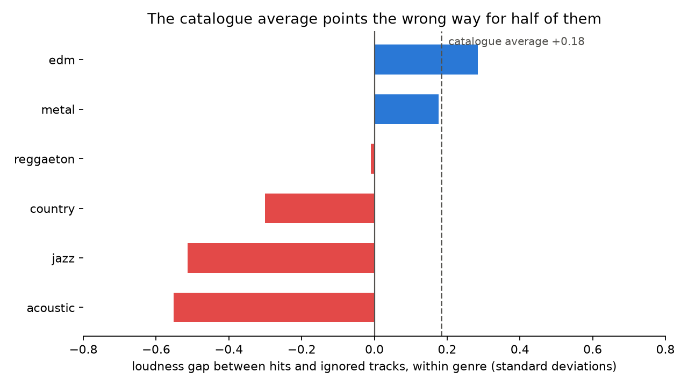
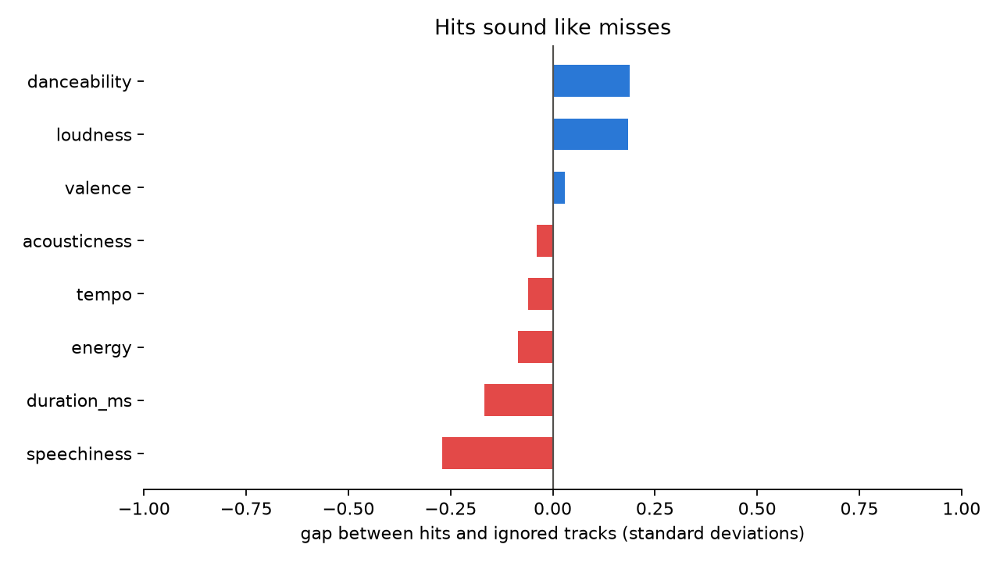
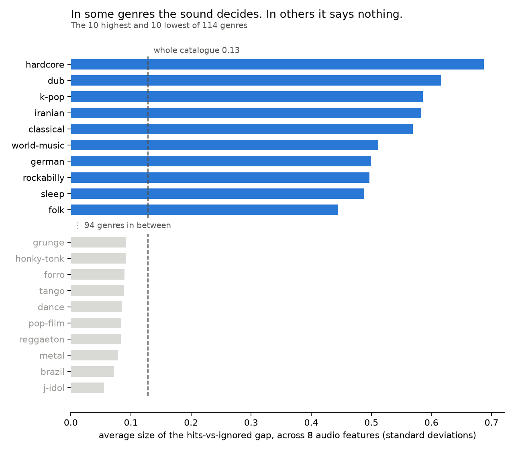

# music-signals

> Does the way a song sounds decide whether it gets played?



## The story

**The question.** Does the way a song sounds decide whether it gets played?

**What I found.** Across 98,000 tracks, barely — no audio feature separates a
hit from an ignored track by even a third of a standard deviation. But that
catalogue-wide answer is worse than useless, because it is assembled from genres
that disagree with each other. Popular EDM and metal tracks are **louder** than
their peers; popular jazz, acoustic and country tracks are **quieter**, by up to
half a standard deviation. Pooled together they cancel, leaving a number that
points the wrong way for half the shelf. Split them apart and the range is 12 to
1: in hardcore, sound separates hits from misses by **0.69** standard
deviations. In j-idol, by **0.055**.

**Why it matters.** "Master it louder" is standard advice, and the
whole-catalogue numbers appear to support it. For a jazz or acoustic artist,
this data says the opposite — the popular records in those genres are the
quieter ones. And for a j-idol or reggaeton artist, the honest answer is that
whatever decides a hit there is not in this dataset at all: no amount of
production tuning shows up in the numbers, so the lever is somewhere else — the
release, the placement, the name on the sleeve.

---

## The three charts

### 1. Hits sound like misses



Across 98,000 tracks, no audio feature separates a hit from an ignored track by
even a third of a standard deviation — whatever makes a song popular, these
metrics cannot hear it.

### 2. The catalogue average points the wrong way for half of them


Loud sells in EDM and metal and costs you in jazz and acoustic — so "master it
louder," the advice the catalogue-wide numbers support, is backwards for half
the shelf.

### 3. In some genres the sound decides. In others it says nothing.



The average size of the hits-vs-ignored gap runs from 0.69 standard deviations
in hardcore down to 0.055 in j-idol — a 12-to-1 spread that the single
catalogue-wide figure of 0.13 describes at neither end.

---

## What this analysis cannot do

Stated up front, because a finding is only worth what its limits are worth.

- **14% of the dataset was dropped.** 16,020 tracks carry `popularity = 0`, and
  that is a sentinel for missing data, not a score — the group includes artists
  with hundreds of millions of plays. They are excluded everywhere in this repo.

- **The popularity metric may be producing part of the duration finding.**
  Popular tracks are ~18 seconds shorter than ignored ones. If popularity is
  built on play counts, a three-minute track accumulates more plays per hour of
  listening than a five-minute one, by arithmetic alone. This dataset cannot
  separate "listeners prefer shorter songs" from "the metric rewards shorter
  songs," and the second explanation is not ruled out.

- **Chart 3's summary is crude by construction.** It averages the gap across
  eight features of different kinds, mashing loudness, tempo and duration into
  one number. It is a ranking, not a measurement.

- **Some "genres" are buckets.** `world-music`, `german` and `iranian` each hold
  several real genres under one label. If one sub-genre inside a bucket is both
  more popular and sonically distinct, this method reads that as "sound decides
  here" when it has actually found two genres wearing one name. Testable, and
  not yet tested.

- **No time axis exists.** The dataset carries no release date, so no claim in
  this repo is about change over time.

---

## The engineering

**Stack.** Python 3, pandas, matplotlib. No notebook — every chart is a script
that runs top to bottom and writes a PNG, so the output is always reproducible
from the committed code.

**Data.** [Spotify Tracks Dataset](https://huggingface.co/datasets/maharshipandya/spotify-tracks-dataset)
— 114,000 tracks across 114 genres, CC0. Not committed (19 MB); fetched by the
command below.

**Run it.**

```bash
python3 -m venv .venv
./.venv/bin/pip install pandas matplotlib

mkdir -p data charts
curl -L -o data/spotify_tracks.csv \
  "https://huggingface.co/datasets/maharshipandya/spotify-tracks-dataset/resolve/main/dataset.csv"

./.venv/bin/python chart1.py
./.venv/bin/python chart2.py
./.venv/bin/python chart3.py
```

**How it's built.** Three steps.

1. **Filter the sentinel.** `popularity == 0` is dropped before anything else.
2. **Build the comparison groups.** Within whatever slice is being examined
   (the whole catalogue, or one genre), take the top and bottom popularity
   quartiles and discard the middle 50%. Extreme groups, not a median split —
   a median split throws near-identical borderline tracks into opposite camps
   and dilutes any real difference toward zero.
3. **Standardize the gap.** Every difference is divided by that slice's own
   standard deviation, so decibels, milliseconds and 0-to-1 ratios land on one
   axis and can be compared honestly.

**Tests.** None yet — B.2/B.3 harden this repo into typed, tested modules.
The scripts are deliberately flat until then.
